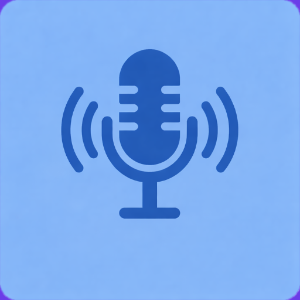
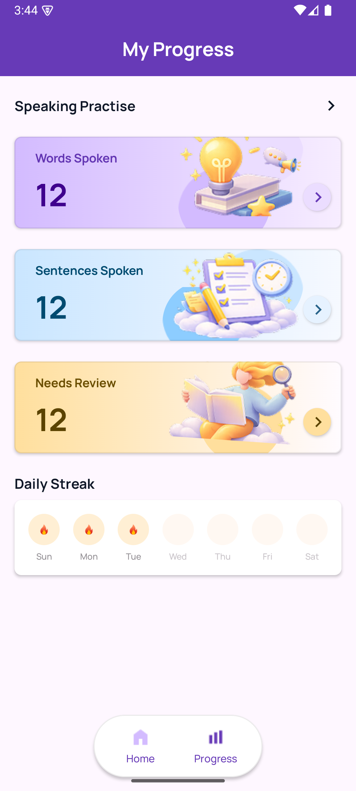
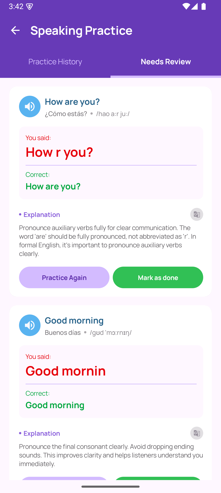
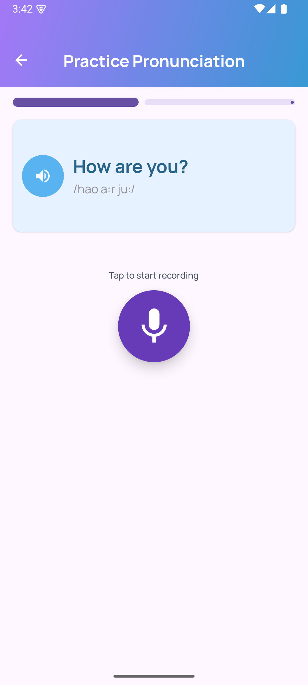
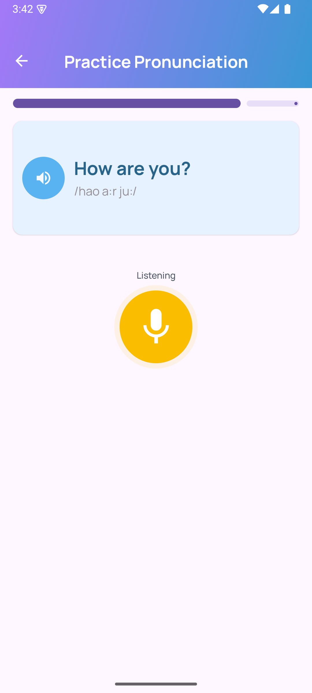
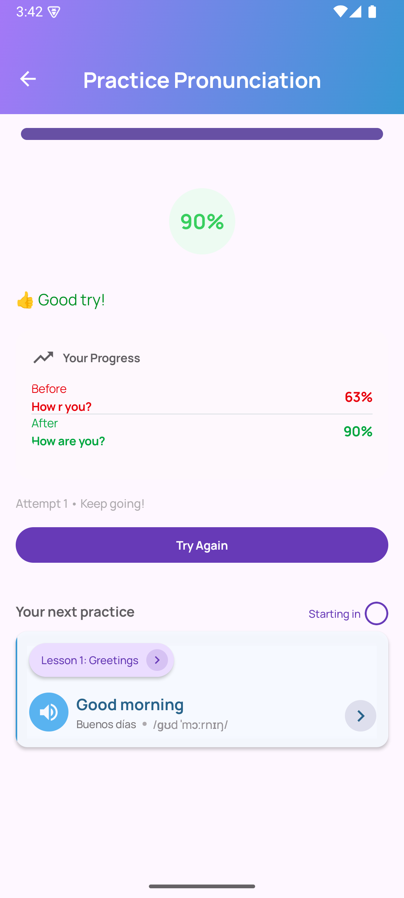

# 🎙️ C3 Paid Demo – Android Prototype




A functional Android prototype developed as part of the C3 hiring assessment.

This project implements the **Progress (Needs Review)** and **Practice Pronunciation** flows based on the provided Figma design.

The implementation focuses on:
- Clean architecture (MVVM)
- Pixel-accurate UI (Jetpack Compose)
- Reusable components
- Smooth state transitions & animations
- Localization support (English & Spanish)
- Production-ready code structure

---

## 📱 Screenshots

| Home              | Needs Review      | Practise-1        |
|-------------------|-------------------|-------------------|
|  |  |  |

Additional UI States:

| Practise-2        | Result            |
|-------------------|-------------------|
|  |  |

> All images are located inside the `/assets` directory.

---

## 🏗️ Architecture

This project follows a clean and scalable structure:

```
core/
 └── ui/
      ├── components/   → Reusable composables
      └── theme/        → Design system (colors, typography, shapes)

features/
 ├── practice/          → Practice Pronunciation feature
 ├── progress/          → Progress screen
 └── review/            → Needs Review screen

navigation/
 └── AppNavGraph.kt     → Navigation graph

MainActivity.kt         → App entry point
```

### Pattern

- **Architecture:** MVVM
- **UI:** Jetpack Compose (Material3)
- **Navigation:** Compose Navigation
- **State Management:** StateFlow
- **Async Handling:** Kotlin Coroutines
- **Persistence (if needed):** DataStore-ready structure

Each feature is isolated and UI components are reusable across screens.

---

## ✨ Implemented Features
### ✅ Needs Review Screen
- Fully interactive cards
- Animated sound button
- Explanation section
- Translate button interaction
- "Practice Again" and "Mark as done" logic
- Proper enabled/disabled states

### ✅ Practice Pronunciation Flow
- Idle → Listening → Result state transitions
- Animated progress bar behavior
- Listening state UI change
- Animated score percentage
- Countdown timer for next practice
- Try Again interaction
- Pixel-accurate pill navigation

### ✅ Result Screen
- Animated score reveal
- Before / After comparison
- Attempt label
- Next practice preview
- Countdown badge

---

## 🌍 Localization
The app supports:
- 🇺🇸 English (default)
- 🇪🇸 Spanish

All strings are placed in `strings.xml` and `values-es/strings.xml`.
No hardcoded text is used.

---

## 🎨 Design System
The UI strictly follows the Figma layout:
- Exact paddings & spacing
- Pill navigation shadow & shape
- Progress bar behavior states
- Typography aligned with Material3 tokens
- Proper contrast & hierarchy

Reusable composables:
- `PracticeWordCard`
- `PracticeResultContent`
- `ReviewItemCard`
- `BottomPillNav`
- `PracticeTopProgress`

---

## 🚀 How to Run

### Requirements
- Android Studio Hedgehog or newer
- Kotlin 1.9+
- Min SDK: 24+
- Compile SDK: 34

### Steps
1. Clone the repository:

```bash
git clone https://github.com/your-username/C3PaidDemo.git
```

---

## 📦 Build APK

To generate a release APK:

```bash
./gradlew assembleRelease
```

The APK will be located at:

```
app/build/outputs/apk/release/
```

---

## ⚖️ Assumptions & Trade-offs

*   Audio recording is UI-simulated (no real speech engine integration).
*   Timers are UI-driven using coroutine delays.
*   Network layer not included (not required for prototype).
*   Focus prioritized on UI accuracy & architecture over backend integration.


---

## 📈 Evaluation Alignment

This implementation prioritizes:
✔ Delivery Accuracy
✔ Clean Code Structure
✔ Proper State Handling
✔ Reusable Components
✔ Smooth UX (no jank)
✔ Scalable Architecture

---

## 👨‍💻 Developer

Mahmut Alperen Ünal
Android Developer

---

## 📄 License

This project is licensed under the MIT License.

See the [LICENSE](LICENSE) file for details.